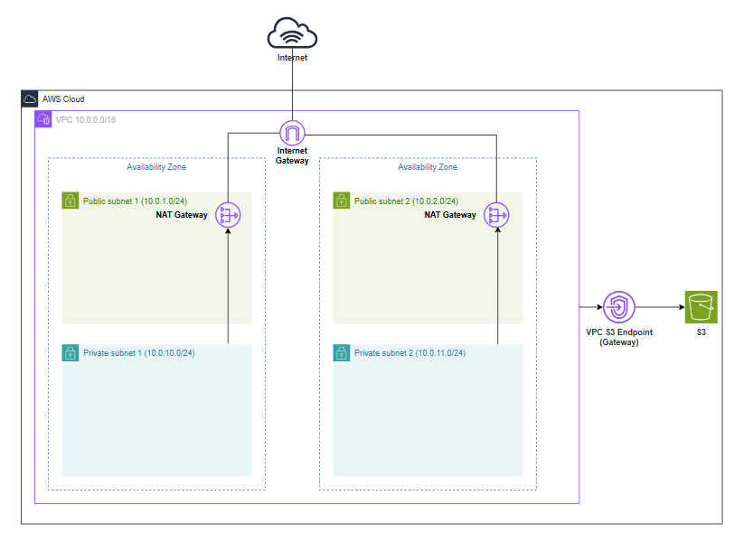

# take-home-test
3 Exrecises for a take home test


## Exercise 1



### Architecture Highlights
- **Subnet Layout:** 4 subnets across 2 Availability Zones (2 public, 2 private).
- **Redundant NAT:** 2 NAT Gateways (one per AZ) with dedicated route tables per private subnet.
- **Dynamic Endpoints:** Configurable map supporting both Gateway and Interface endpoints without hardcoded resources.
- **VPC Flow Logs**: Integrated with CloudWatch Logs to capture all network traffic for real-time connection security tracking.

### Folder Layout
- modules/vpc/: Core reusable module definitions.
- stages/: Environment input variables (dev.tfvars, stg.tfvars, prd.tfvars).
- tf-backend/: Isolated backend state configs (dev.hcl, stg.hcl, prd.hcl).

### Deployment Commands
- **Initialization/Deployment & Stage Selection:**
  ```bash
  terraform init -reconfigure -backend-config=tf-backend/<stage>.hcl
  terraform plan -var-file=stages/<stage>.tfvars
  terraform apply -var-file=stages/<stage>.tfvars
  ```


- **terraform plan output** 
  ```bash
  Plan: 25 to add, 0 to change, 0 to destroy.
  ```

## Exercise 2

### Architecture Highlights
- **Compliance & Hard Expiration:** Enforces a strict 180-day retention policy where objects are permanently deleted to meet regulatory limits.
- **Cost-Optimization:** Automatically transitions backup archives to S3 Glacier at 60 days to cut active storage costs.
- **Access:** Custom bucket policy explicitly allows external IAM roles (backup_uploader) to PutObject and AbortMultipartUpload.
- **Security Hardening:** Blocks all public access, mandates TLS/HTTPS-only requests, and applies default AES-256 encryption.
- **Versioning:** Enables versioning with automated expiration for noncurrent versions (21 days).

### Deployment Commands
- **Initialization/Deployment & Stage Selection:**
  ```bash
  terraform init -reconfigure -backend-config=tf-backend/<stage>.hcl
  terraform plan -var-file=stages/<stage>.tfvars
  terraform apply -var-file=stages/<stage>.tfvars
  ```

- **terraform plan output** 
VPC module is still included in this plan, so in total there is 7 reosurces to be created in the backup s3 module
  ```bash
  Plan: 32 to add, 0 to change, 0 to destroy.
  ```
